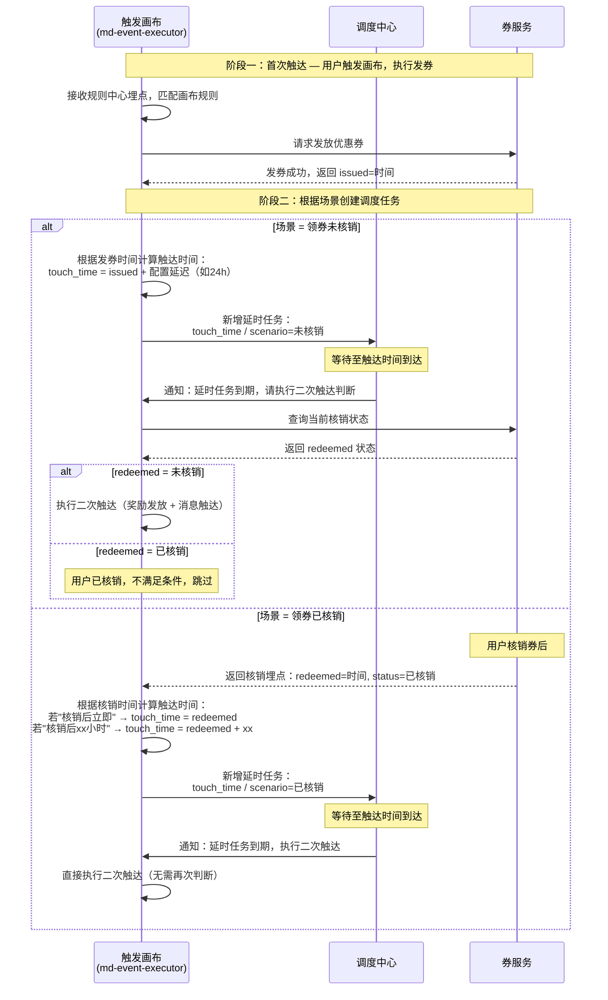

# 二次触达配置

## 功能点
- 在画布流程中添加「+ 二次触达」按钮（类似「+ 分流策略」样式）
- 点击「+ 二次触达」按钮，右侧弹出配置抽屉
- 抽屉内分两步配置：第一步配置二次触达人群，第二步配置二次触达执行动作
- 配置完成后在画布上预览二次触达节点卡片
- 用户点击「保存画布」提交

## 数据字段

| 字段名 | 类型 | 说明 |
|--------|------|------|
| relatedCanvas | string | 关联画布名称，默认当前画布，不可修改 |
| scenario | string | 二次触达场景：领券未核销 / 领券已核销 |
| couponIds | string[] | 已发放的优惠券，多选，取自原画布配置的优惠券 |
| touchTimeType | string | 触达时间类型：固定时间 / 动态时间（未核销场景）；核销后立即 / 核销后xx小时（已核销场景） |
| touchTimeValue | number | 动态时间的小时数（如发券后 24 小时） |
| touchTimeFixed | string | 固定触达时间（如 2026-05-01 10:00） |
| actionType | string | 执行动作类型：奖励发放 / 消息触达 |
| actionConfig | object | 执行动作详细配置（奖励类型、金额、消息模板等） |

## 交互说明
- 画布流程：目标人群 → 进入人群 → ① 目标策略 → 执行动作，横向排列
- 点击「+ 二次触达」→ 右侧弹出抽屉
- 抽屉内 Steps 组件引导两步配置
- 点击「上一步/下一步」在步骤间切换
- 点击「取消」关闭抽屉，丢弃未保存内容
- 点击「确定」关闭抽屉，画布上显示二次触达预览卡片（类似 4-bonus_refer 中的卡片）
- 预览卡片可点击再次打开抽屉编辑
- 主题色 #1050DC

---

## 技术实现链路

### 涉及系统

| 系统 | 角色 |
|------|------|
| md-event-executor（触发画布） | 画布执行引擎，负责规则匹配、二次触达判断与调度 |
| md-rule-center（规则中心） | 消费埋点，判断用户是否命中规则 |
| bus-task-center（奖励中心） | 负责奖励发放调度 |
| 券服务（=奖励中心底层） | 负责真正发券、记录核销状态 |
| 埋点（消息队列） | 系统间异步通信通道 |
| Redis | 存储券核销状态，供画布快速查询 |
| 调度表（MySQL） | 存储二次触达的触达时间和执行状态 |

### 核心概念：两种场景的调度差异

二次触达配置时用户选择场景（**领券未核销** / **领券已核销**），涉及三个系统：**画布**（md-event-executor）、**券服务**、**调度中心**。两种场景的核心差异：

| 对比项 | 领券未核销 | 领券已核销 |
|--------|-----------|-----------|
| 触达时间计算时机 | 发券后立即根据发券时间计算 | 等待券服务返回核销时间后再计算 |
| 调度中心到期时 | 画布需查询券服务最新核销状态，判断是否执行 | 画布直接执行，无需再次判断 |
| 用户中途核销/未核销的影响 | 用户如果中途核销了，画布判断后跳过不触达 | 用户核销是触发前提，核销后才开始算时间 |

### 二次触达交互链路

---

## 新增内容清单

| 新增项 | 负责方 | 说明 |
|--------|--------|------|
| 券服务 → 画布（发券埋点） | 券服务 | 发券成功后新增一条埋点，画布引擎消费 |
| 券服务 → 画布（核销埋点） | 券服务 | 核销成功后新增一条埋点，画布引擎消费 |
| 画布读/写 Redis | md-event-executor | 收到埋点后写入券核销状态 |
| 画布读/写调度表 | md-event-executor | 记录触达时间和执行状态 |
| 画布定时任务 | md-event-executor | 每分钟扫描到期的调度记录 |
| 画布 → 奖励中心（二次触达埋点） | md-event-executor | 二次触达时直接发埋点给 bus-task-center，不经过规则中心 |

## 与首次触达链路的区别

| 对比项 | 首次触达 | 二次触达 |
|--------|---------|---------|
| 触发源头 | 用户行为 → 规则中心埋点 | 定时任务扫描调度表 |
| 判断逻辑 | 规则中心判断用户是否符合条件 | 画布自己查 Redis 判断券是否核销 |
| 消息流向 | 规则中心 → 画布 → 奖励中心 → 券服务 | 画布 → 奖励中心 → 券服务（跳过规则中心） |
